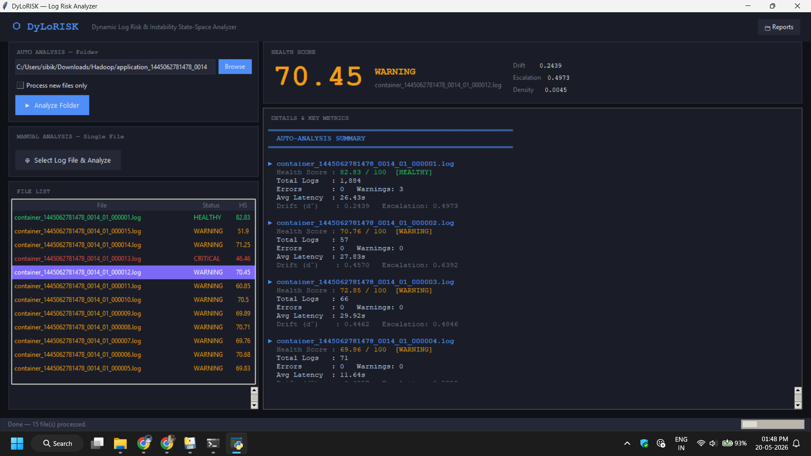
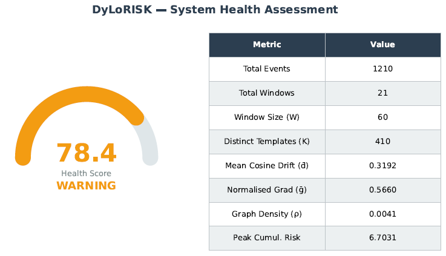
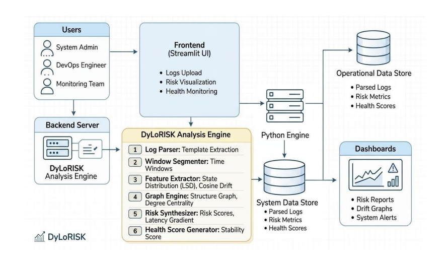

# DyLoRISK – Dynamic Log Risk and Instability State-Space Framework

> A Python-based framework for continuous log analysis, behavioral drift detection, and system health assessment.


---

## Overview

DyLoRISK (Dynamic Log Risk and Instability State-Space Framework) is a log analytics framework that evaluates system health by analyzing execution logs and detecting behavioral changes over time. Unlike traditional log analyzers that only classify logs as normal or abnormal, DyLoRISK continuously models system stability using statistical analysis, graph-based modeling, and interpretable health scoring.

The framework supports both single-file and batch log analysis through a graphical user interface (GUI) and automatically generates detailed PDF reports and visualization dashboards.

---
## Screenshots

### Folder Analysis



### Generated Report



### System Architecture


## Features

- 📄 Single-file and folder-based log analysis
- 📊 Health Score (0–100) calculation
- 📈 Behavioral Drift Detection
- 🔍 Root Cause Analysis
- ⚠️ Warning and Critical Event Detection
- 📉 Latency Escalation Analysis
- 🌐 Log Structure Graph Analysis
- 📑 Automatic PDF Report Generation
- 📊 Diagnostic Visualization Dashboard
- ⚡ SHA-256 Content-Based Caching
- 🖥️ User-Friendly Tkinter GUI

---

## Analysis Pipeline

DyLoRISK follows an 11-stage analysis pipeline:

1. Log Parsing
2. Window Segmentation
3. Log State Distribution Modeling
4. Behavioral Drift Detection
5. Shannon Entropy Analysis
6. Latency Escalation Analysis
7. Log Structure Graph Construction
8. Health Score Computation
9. Visualization Generation
10. PDF Report Generation
11. Results & Root Cause Analysis

---

## Health Score

The overall system health is calculated using:

```text
Health Score = max(0, 100 − 50 × Mean Drift − 10 × Normalized Escalation)
```

| Score | Status |
|--------|--------|
| **80 – 100** | 🟢 Healthy |
| **50 – 79** | 🟡 Warning |
| **0 – 49** | 🔴 Critical |

---

## Technologies Used

- Python
- Tkinter
- NumPy
- Pandas
- SciPy
- Scikit-learn
- NetworkX
- Matplotlib

---

## Project Structure

```
DyLoRISK/
│
├── dylorisk.py
├── dylorisk_gui_v6.py
├── dylorisk_score_engine.py
├── dylorisk_cache.py
├── run_my_log.py
├── run.bat
├── ARCHITECTURE_PLAN.md
├── README.md
│
├── reports/
│   ├── pdf/
│   └── plots/
│
└── logs/
```

---

## Installation

Clone the repository:

```bash
git clone https://github.com/SIBIKUMAR-R/DyLoRISK.git
```

Move into the project directory:

```bash
cd DyLoRISK
```

Install the required dependencies:

```bash
pip install numpy pandas scipy matplotlib networkx scikit-learn
```

---

## Running the Project

Launch the graphical interface:

```bash
python dylorisk_gui_v6.py
```

Or use:

```bash
run.bat
```

---

## Output

For every analyzed log, DyLoRISK generates:

- Health Score
- System Status
- Drift Metrics
- Root Cause Analysis
- Event Statistics
- Graph Metrics
- Diagnostic Charts
- PDF Analysis Report

---

## Applications

- Distributed System Monitoring
- Hadoop/YARN Log Analysis
- Cloud Infrastructure Monitoring
- DevOps & Site Reliability Engineering (SRE)
- Predictive Failure Detection
- Large-Scale Log Analytics

---

## Future Enhancements

- Real-time streaming log analysis
- Apache Kafka integration
- Web-based dashboard
- REST API support
- Docker deployment
- Cloud-native architecture
- Machine learning-assisted anomaly prediction

---

## Author

**Sibikumar R**

Final Year B.Tech – Information Technology

GitHub: https://github.com/SIBIKUMAR-R

---

## License

This project is developed for academic and research purposes.
